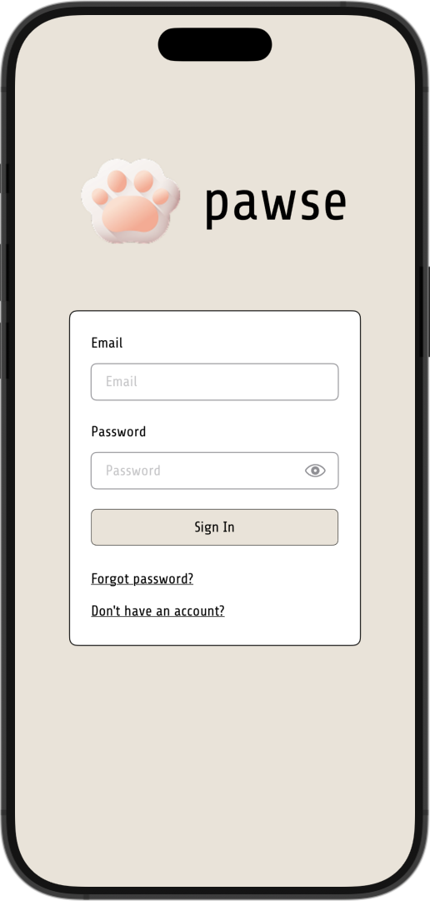
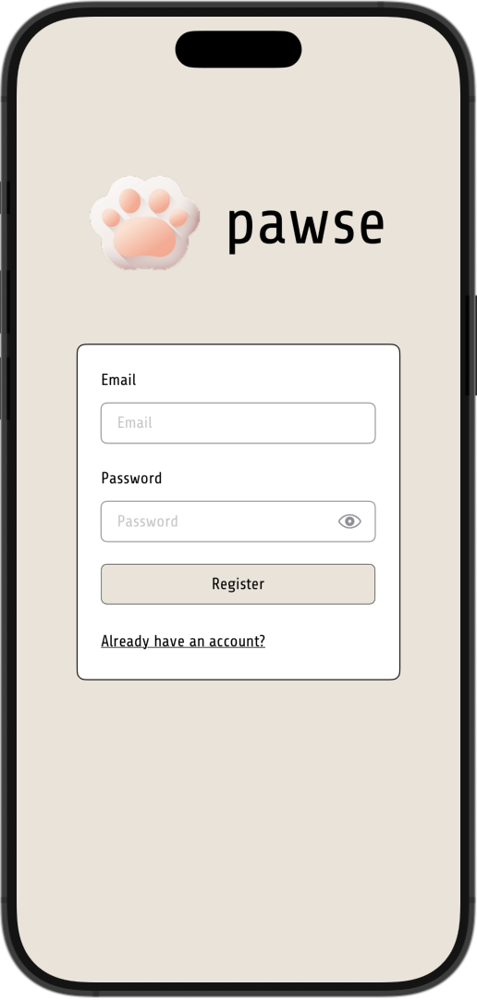
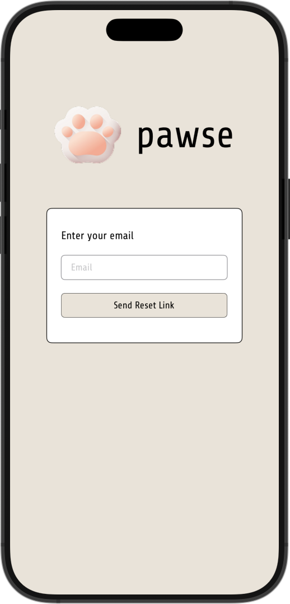
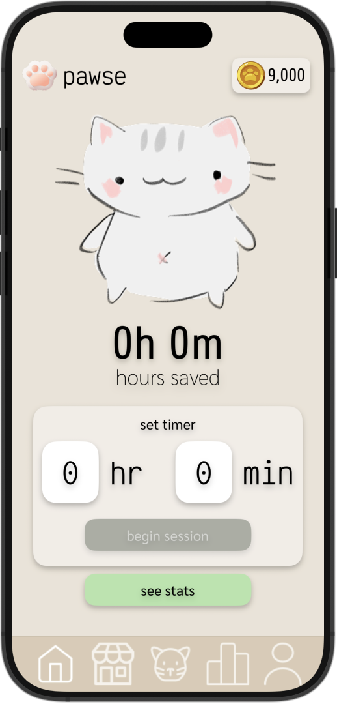
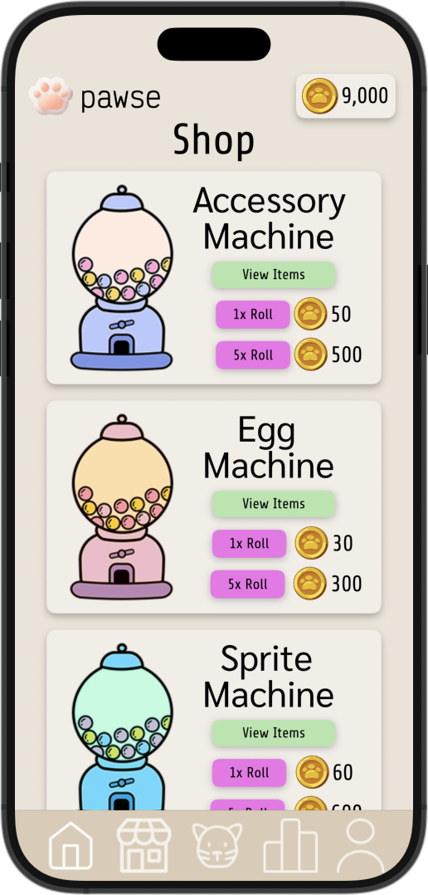
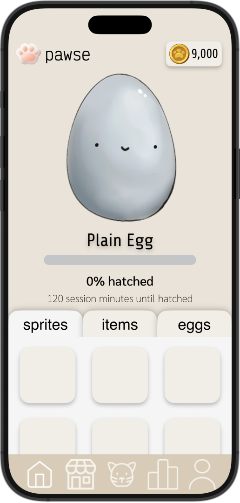
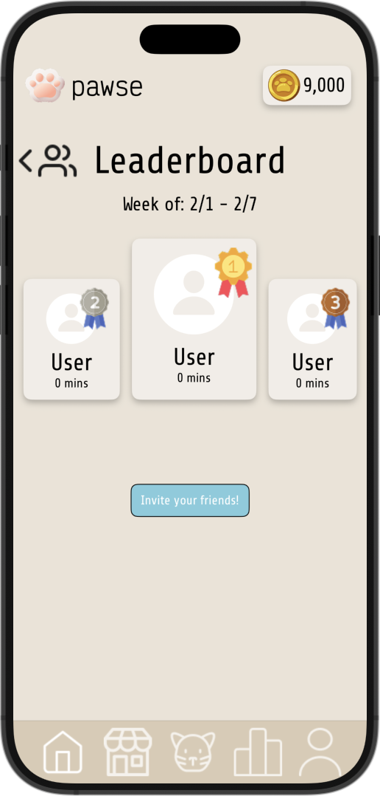
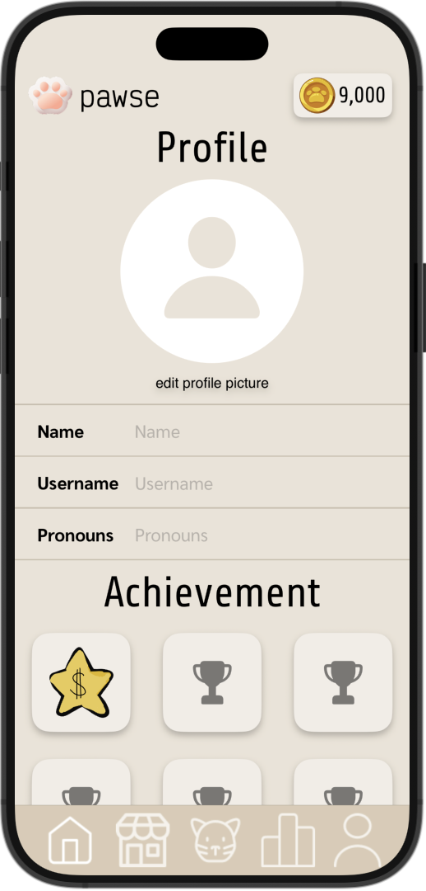

# 🐾 Pawse ⏱️

## 🌟 Introduction
Welcome to the **Pawse** repository! Pawse is an iOS focus timer and productivity app designed to help users stay focused while making work sessions fun and rewarding. By combining timed focus sessions with a gacha-style reward system, Pawse motivates users to build consistent habits, collect virtual companions, and track progress over time.

## 💡 Features
- **Focus Timer Sessions:** Structured focus sessions to help users stay productive and minimize distractions.
- **Gacha Reward System:** Earn and unlock collectible virtual items and characters through completed focus sessions.
- **Inventory System:** View and manage collected items earned through productivity.
- **Friends & Social Features:** Connect with friends and compare focus progress.
- **Leaderboard:** Compete with others based on completed sessions and productivity stats.
- **User Authentication:** Secure login, signup, and password recovery flows.
- **Profile Management:** Customize your profile and view personal productivity metrics.
- **Modern SwiftUI Interface:** Clean, intuitive, and responsive UI built natively for iOS.

## 💻 Technologies
- **Swift:** Core programming language for iOS development.
- **SwiftUI:** Declarative UI framework for building modern iOS interfaces.
- **MVVM Architecture:** Clean separation of views, models, and logic.
- **Supabase:** Backend services for authentication, database storage, and user data.
- **iOS SDK:** Native APIs for timers, animations, and user interactions.

## 🛠️ Installation and Setup
**Clone the Repository**
```
git clone https://github.com/zhangbri/eecs497-mde.git
```

**Configure backend**
- Create a Supabase project
- Add your Supabase URL and anon key in the configuration
- Ensure network permissions are enabled

**Build and run**
- Select an iOS Simulator or physical device
- Press **Run (⌘R)** in Xcode

## 📁 Directory Structure
- `ScreenTimeApp.swift` – App entry point and root configuration.
- `AuthRootView.swift` – Root authentication flow controller.
- `LoginView.swift` – User login interface.
- `RegisterView.swift` – New user registration flow.
- `ForgotPasswordView.swift` – Password recovery flow.
- `SupabaseManager.swift` – Handles authentication, database access, and backend communication.
- `TabRouter.swift` – Controls tab navigation and active app state.
- `NavBar.swift` – Custom tab bar and navigation UI.
- `HomeView.swift` – Focus timer and main dashboard.
- `GachaView.swift` – Gacha reward system and unlock animations.
- `InventoryModel.swift` – Data model for collectible items.
- `InventoryView.swift` – Displays unlocked rewards and inventory.
- `FriendsView.swift` – Friends list and social interactions.
- `LeaderboardView.swift` – Rankings based on focus sessions.
- `ProfileView.swift` – User profile and productivity statistics.

## 🔗 Live Demo
🎥 Video Demo: https://www.youtube.com/watch?v=cB7kviCbirw

## 📸 Screenshots
<p align="center">
  
  
  
</p>

<p align="center">
  
  
  
</p>

<p align="center">
  
  
</p>

